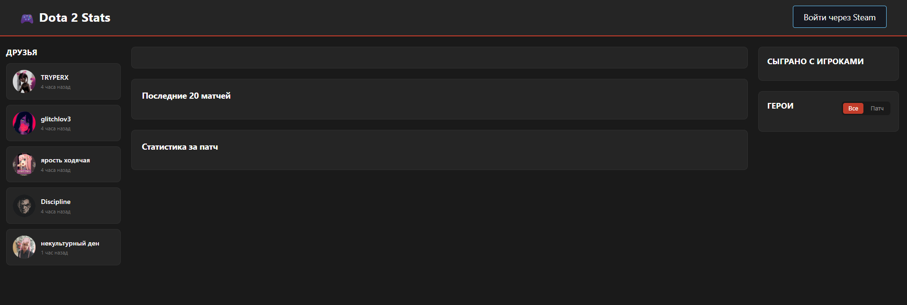
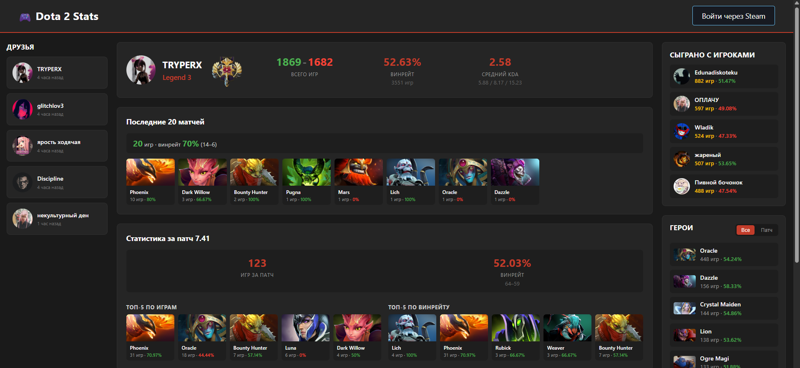
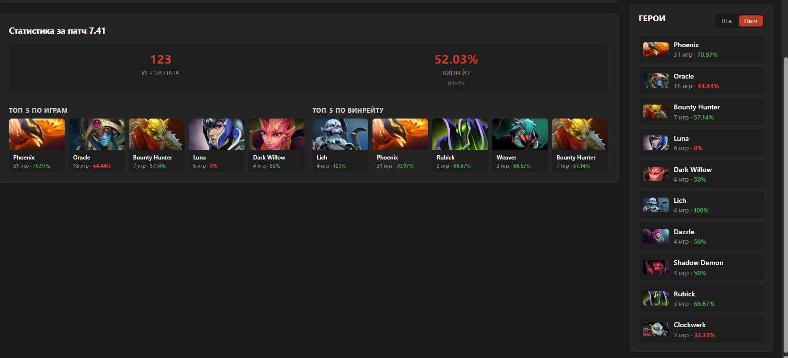

# Проект Dota2 Stats


**Веб-приложение для просмотра статистики игроков Dota 2 через [OpenDota API](https://docs.opendota.com/). Создано для учебных целей и как площадка для практики в QA-тестировании.**
## Оглавление
- [О проекте](#о-проекте)
  - [Какие проблемы будет решать?](#какие-проблемы-будет-решать)
- [Функционал](#функционал)
- [Стек технологий](#стек-технологий)
- [Скриншоты](#скриншоты)
- [Установка и запуск](#установка-и-запуск)
- [Разработка](#разработка)
- [Тестирование](#тестирование)
- [CI/CD](#cicd)
- [Документация](#документация)
- [Ссылки](#ссылки)
## О проекте
Идея - сделать сайт, на котором я и мои друзья могли бы видеть статистику друг друга в Dota 2. Изначально проект задумывался как учебный, но со временем стал площадкой для практики в QA: написание тест-плана, чек-листов, автотестов и интеграции их в CI/CD.
### _Какие проблемы будет решать?_
Наша компания часто сталкивается с тем, что тяжело собраться вместе и разброс уровня игры среди друзей достаточно большой. Я бы хотел реализовать возможность позвать друга в игру через приложение. Возможно, даже в первую очередь использовать приложение, как способ позвать друзей в игру, собрать всех вместе.
В будущем, функции будут давать возможность пользователю нажать кнопку и, грубо говоря, создать запрос на игру(например сайт будет отправлять уведомление на сайте или в steam остальным пользователям о том, что кто-то зовет их в игру, с ссылкой на лобби, по которой они смогут зайти в игру и попасть в группу), также пользователи смогут заходить на сайт и самостоятельно просматривать запросы на игру или создавать запрос на какое то определенное время, своего рода расписание, в котором другие пользователи смогут отметить будут ли они играть или нет, а так же функция через steam бота и Node.JS чтобы прямо через сайт отправить игроку приглашение присоединиться к игре в steam.
_Но пока это только в планах..._
## Функционал
- Авторизация через Steam OpenID
- Просмотр списка зарегистрированных пользователей
- Профиль игрока: ранг, MMR, KDA, винрейт, W-L
- Статистика за последние 20 матчей
- Статистика за текущий патч: топ-5 героев по играм и винрейту
- Топ-10 героев за всё время / за патч
- Список сокомандников (пиры) — топ-5 игроков, с которыми чаще всего играл
## Стек технологий
- **Backend:** FastAPI, SQLAlchemy, PyMySQL
- **Frontend:** HTML, CSS, Vanilla JS
- **БД:** MySQL 8.0
- **Инфраструктура:** Docker, Docker Compose, GitHub Actions
- **Внешние API:** Steam OpenID, OpenDota API, Steam Web API
- **Тестирование:** pytest, Playwright, Postman
## Скриншоты
### **Главная страница**

### **Профиль игрока**

### **Статистика за патч**

## Установка и запуск
### Требования
- Docker и Docker Compose
- Git
### Шаги
```bash
git clone git@github.com:TRYPERX311/dota2stats.git
cd dota2stats
cp .env.example .env
# заполнить .env своими значениями
docker compose up -d --build
```
Приложение будет доступно по адресу http://localhost:5000.
## Разработка
- `main.py` — FastAPI-роуты
- `collector.py` — сбор статистики из OpenDota
- `db.py` — модели SQLAlchemy
- `static/`, `templates/` — фронтенд
## Тестирование
### Виды тестирования
- Ручное (чек-листы, тест-кейсы)
- API-тесты (pytest)
- UI-тесты (Playwright)
- Регрессионное (после деплоя)
### Запуск автотестов
```bash
pip install -r requirements-test.txt
pytest tests -v
```
## CI/CD
- **Deploy:** при push в `main` GitHub Actions деплоит на VPS ([deploy.yml](.github/workflows/deploy.yml)).
- **Tests:** при push и PR запускаются pytest и Playwright ([tests.yml](.github/workflows/tests.yml)).
## Документация
### Внешние
- [OpenDota API](https://docs.opendota.com/)
### Тестирование
- [Test Plan](docs/TestPlan.md)
- [Checklists](docs/checklists/)
- [Test Cases](docs/testcases/)
- [Bug Reports](docs/bugs/)
- [Test Report](docs/TestReport.md)
### API
- **Swagger / API** — доступно локально по адресу `http://localhost:5000/docs` _(в dev-режиме)_.
## Ссылки
- **Прод:** http://45.86.245.140.nip.io/
- **Репозиторий:** https://github.com/TRYPERX311/dota2stats
- **Автор:** [@TRYPERX311](https://github.com/TRYPERX311)

