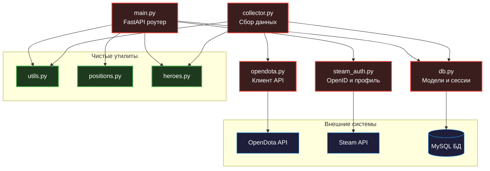

# Архитектура модулей

Диаграмма зависимостей между модулями проекта. 
Зелёные — чистые утилиты 
Красные — модули с зависимостями 

```mermaid
flowchart TD
    
    subgraph EXTERNAL [Внешние системы]
        OpenDota[OpenDota API]
        Steam[Steam API]
        MySQL[(MySQL БД)]
    end

    %% === ТОЧКА ВХОДА ===
    Main[main.py\nFastAPI роутер]
    
    
    Auth[steam_auth.py\nOpenID и профиль]
    Collector[collector.py\nСбор данных]
    DB[db.py\nМодели и сессии]
    OpenDotaClient[opendota.py\nКлиент API]
    
    
    subgraph UTILS [Чистые утилиты]
        Utils[utils.py]
        Positions[positions.py]
        Heroes[heroes.py]
    end

    
    Main --> Auth
    Main --> DB
    Main --> Positions
    Main --> Heroes
    Main --> Utils
    
    Auth --> Steam
    
    Collector --> OpenDotaClient
    Collector --> DB
    Collector --> Utils
    Collector --> Heroes
    
    OpenDotaClient --> OpenDota
    DB --> MySQL
    
    classDef clean fill:#1e3a1e,stroke:#4caf50,stroke-width:2px,color:#fff
    classDef dirty fill:#3a1e1e,stroke:#f44336,stroke-width:2px,color:#fff
    classDef ext fill:#1e1e3a,stroke:#2196f3,stroke-width:1px,color:#fff
    
    class Utils,Positions,Heroes clean
    class Main,Auth,Collector,DB,OpenDotaClient dirty
    class OpenDota,Steam,MySQL ext
```