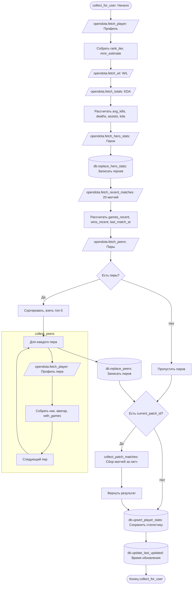

# Работа коллектора, детализация
## collect_for_user(): что происходит с пользователем

```mermaid
flowchart TD
    StartUser([collect_for_user: Начало]) --> FetchProfile[/opendota.fetch_player: Профиль/]
    FetchProfile --> SaveProfileData[Собрать rank_tier, mmr_estimate]
    
    SaveProfileData --> FetchWL[/opendota.fetch_wl: W/L/]
    FetchWL --> FetchTotals[/opendota.fetch_totals: KDA/]
    FetchTotals --> CalcKDA[Рассчитать avg_kills, deaths, assists, kda]
    
    CalcKDA --> FetchHeroes[/opendota.fetch_hero_stats: Герои/]
    FetchHeroes --> SaveHeroes[(db.replace_hero_stats: Записать героев)]
    
    SaveHeroes --> FetchRecent[/opendota.fetch_recent_matches: 20 матчей/]
    FetchRecent --> CalcRecent[Рассчитать games_recent, wins_recent, last_match_at]
    
    CalcRecent --> FetchPeers[/opendota.fetch_peers: Пиры/]
    FetchPeers --> CheckPeers{Есть пиры?}
    CheckPeers -- Нет --> SkipPeers[Пропустить пиров]
    CheckPeers -- Да --> SortPeers[Сортировать, взять топ-5]
    
    SortPeers --> LoopPeer[Для каждого пира]
    subgraph PEERS [collect_peers]
        LoopPeer --> FetchPeerProfile[/opendota.fetch_player: Профиль пира/]
        FetchPeerProfile --> SavePeerData[Собрать ник, аватар, with_games]
        SavePeerData --> NextPeer[Следующий пир]
        NextPeer --> LoopPeer
    end
    LoopPeer --> SavePeers[(db.replace_peers: Записать пиров)]
    
    SkipPeers --> CheckPatch{Есть current_patch_id?}
    SavePeers --> CheckPatch
    
    CheckPatch -- Да --> CallPatch[collect_patch_matches: Сбор матчей за патч]
    CheckPatch -- Нет --> UpsertStats
    
    CallPatch --> EndPatch[Вернуть результат]
    EndPatch --> UpsertStats
    
    UpsertStats[(db.upsert_player_stats: Сохранить статистику)] --> UpdateLast[(db.update_last_updated: Время обновления)]
    
    UpdateLast --> EndUser([Конец collect_for_user])
```