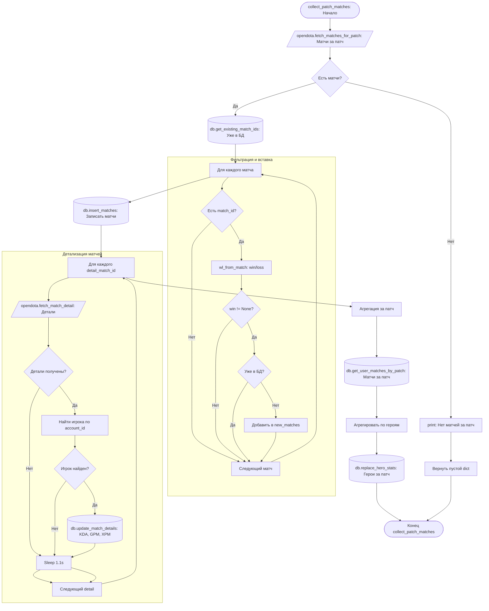

# Работа коллектора, детализация
## collect_patch_matches()

```mermaid
flowchart TD
    StartPatch([collect_patch_matches: Начало]) --> FetchPatchMatches[/opendota.fetch_matches_for_patch: Матчи за патч/]
    FetchPatchMatches --> CheckMatches{Есть матчи?}
    
    CheckMatches -- Нет --> LogMatchErr[print: Нет матчей за патч]
    LogMatchErr --> ReturnEmpty[Вернуть пустой dict]
    
    CheckMatches -- Да --> GetExisting[(db.get_existing_match_ids: Уже в БД)]
    GetExisting --> LoopMatch[Для каждого матча]
    
    subgraph FILTER [Фильтрация и вставка]
        LoopMatch --> CheckMatchId{Есть match_id?}
        CheckMatchId -- Нет --> NextMatch[Следующий матч]
        CheckMatchId -- Да --> CalcWL[wl_from_match: win/loss]
        CalcWL --> CheckWin{win != None?}
        CheckWin -- Нет --> NextMatch
        CheckWin -- Да --> CheckExisting{Уже в БД?}
        CheckExisting -- Да --> NextMatch
        CheckExisting -- Нет --> AddToNew[Добавить в new_matches]
        AddToNew --> NextMatch
        NextMatch --> LoopMatch
    end
    
    LoopMatch --> InsertMatches[(db.insert_matches: Записать матчи)]
    
    InsertMatches --> LoopDetail[Для каждого detail_match_id]
    
    subgraph DETAILS [Детализация матчей]
        LoopDetail --> FetchDetail[/opendota.fetch_match_detail: Детали/]
        FetchDetail --> CheckDetail{Детали получены?}
        CheckDetail -- Нет --> SleepDetail[Sleep 1.1s]
        SleepDetail --> NextDetail[Следующий detail]
        
        CheckDetail -- Да --> FindPlayer[Найти игрока по account_id]
        FindPlayer --> CheckPlayer{Игрок найден?}
        CheckPlayer -- Нет --> SleepDetail
        CheckPlayer -- Да --> SaveMatchDetails[(db.update_match_details: KDA, GPM, XPM)]
        SaveMatchDetails --> SleepDetail
        SleepDetail --> NextDetail
        NextDetail --> LoopDetail
    end
    
    LoopDetail --> Aggregate[Агрегация за патч]
    Aggregate --> GetPatchMatches[(db.get_user_matches_by_patch: Матчи за патч)]
    GetPatchMatches --> CalcHeroAgg[Агрегировать по героям]
    CalcHeroAgg --> SavePatchHeroes[(db.replace_hero_stats: Герои за патч)]
    SavePatchHeroes --> EndPatch([Конец collect_patch_matches])
    
    ReturnEmpty --> EndPatch
```