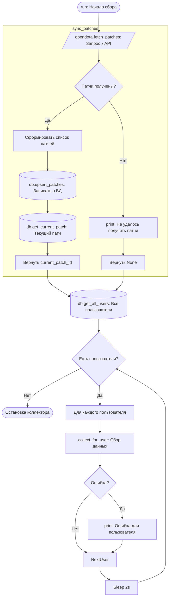

# Работа коллектора, общая схема
## run() + sync_patches() + цикл по пользователям

```mermaid
flowchart TD
    Start([run: Начало сбора]) --> FetchPatches[/opendota.fetch_patches: Запрос к API/]
    
    subgraph SYNC [sync_patches]
        FetchPatches --> CheckPatches{Патчи получены?}
        CheckPatches -- Нет --> LogPatchErr[print: Не удалось получить патчи]
        LogPatchErr --> ReturnNone[Вернуть None]
        
        CheckPatches -- Да --> BuildPatches[Сформировать список патчей]
        BuildPatches --> SavePatches[(db.upsert_patches: Записать в БД)]
        SavePatches --> GetCurrent[(db.get_current_patch: Текущий патч)]
        GetCurrent --> ReturnId[Вернуть current_patch_id]
    end
    
    ReturnId --> GetUsers[(db.get_all_users: Все пользователи)]
    ReturnNone --> GetUsers
    GetUsers --> CheckUsers{Есть пользователи?}
    
    CheckUsers -- Нет --> Stop([Остановка коллектора])
    CheckUsers -- Да --> LoopUser[Для каждого пользователя]
    
    LoopUser --> CallCollect[collect_for_user: Сбор данных]
    
    CallCollect --> TryCatch{Ошибка?}
    TryCatch -- Да --> LogErr[print: Ошибка для пользователя]
    TryCatch -- Нет --> NextUser
    LogErr --> NextUser
    
    NextUser --> Sleep[Sleep 2s]
    Sleep --> CheckUsers
```
