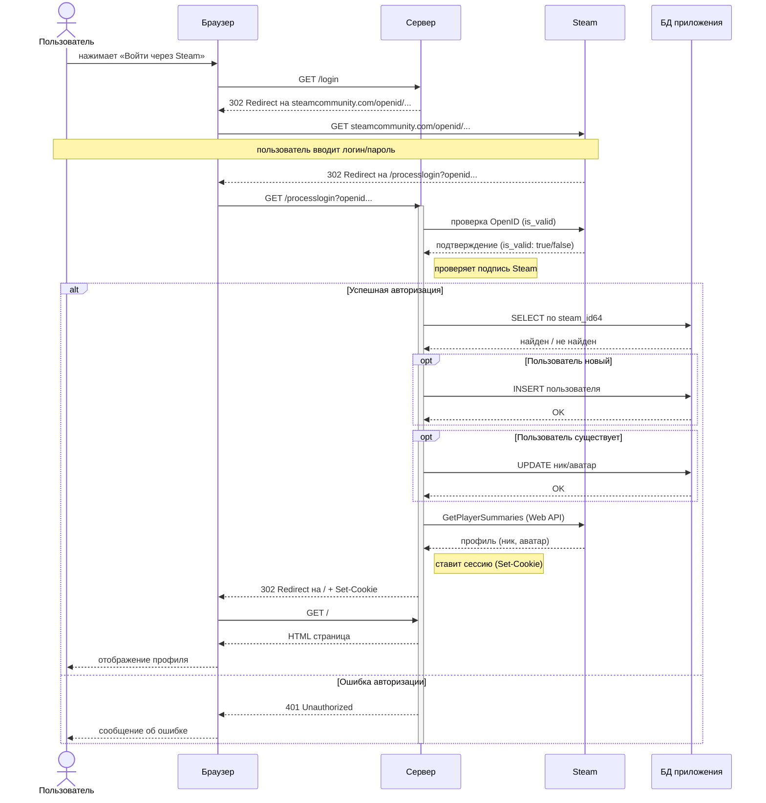

# Диаграмма авторизации в Steam

```mermaid
sequenceDiagram
    actor U as Пользователь
    participant B as Браузер
    participant S as Сервер
    participant ST as Steam
    participant DB as БД приложения

    %% Пользователь инициирует вход
    U->>B: нажимает «Войти через Steam»
    
    %% Браузер запрашивает /login у сервера
    B->>S: GET /login
    
    %% Сервер отвечает редиректом на Steam OpenID
    S-->>B: 302 Redirect на steamcommunity.com/openid/...
    
    %% Браузер идёт на Steam
    B->>ST: GET steamcommunity.com/openid/...
    
    %% Пользователь вводит данные на стороне Steam
    Note over U,ST: пользователь вводит логин/пароль
    
    %% Steam возвращает редирект обратно на /processlogin
    ST-->>B: 302 Redirect на /processlogin?openid...
    
    %% Браузер идёт на сервер с параметрами
    B->>S: GET /processlogin?openid...
    
    activate S
    
    %% Сервер проверяет подпись у Steam
    S->>ST: проверка OpenID (is_valid)
    ST-->>S: подтверждение (is_valid: true/false)
    
    Note right of S: проверяет подпись Steam
    
    %% Успех или ошибка
    alt Успешная авторизация
        
        %% Поиск пользователя в БД
        S->>DB: SELECT по steam_id64
        DB-->>S: найден / не найден
        
        %% Если новый — создать
        opt Пользователь новый
            S->>DB: INSERT пользователя
            DB-->>S: OK
        end
        
        %% Если существует — обновить ник/аватар
        opt Пользователь существует
            S->>DB: UPDATE ник/аватар
            DB-->>S: OK
        end
        
        %% Получение профиля через Steam Web API
        S->>ST: GetPlayerSummaries (Web API)
        ST-->>S: профиль (ник, аватар)
        
        %% Сервер ставит сессию
        Note right of S: ставит сессию (Set-Cookie)
        
        %% Редирект на главную
        S-->>B: 302 Redirect на / + Set-Cookie
        
        %% Браузер открывает главную
        B->>S: GET /
        S-->>B: HTML страница
        B-->>U: отображение профиля
        
    else Ошибка авторизации
        S-->>B: 401 Unauthorized
        B-->>U: сообщение об ошибке
    end
    
    deactivate S
```